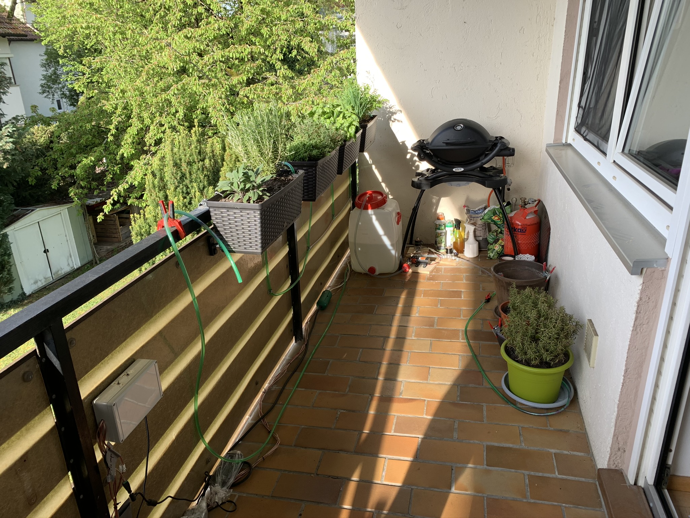

# Arduino_Watering_System

This repo was created for my own plant watering system on my balcony. Whenever I have new ideas I will update the code.

There are several folders in the repo. The most interesting for others is possibly the "deployment" folder. You can have a
look at the Arduino entry point in the "deployment.ino". All self written libraries are within the "deployment" folder.

If you want to copy my plant watering system you can have a look at the "doc" folder. In "circuit_diagram" you find a Fritzing
diagramm of my system. In "software" you'll find some useful tipps on how to handle the code.

All other folders are used for developing this project further and are possibly of minor interest to you:
The folder "src" contains the development code of my project including all unit tests. I use this folder to develop Arduino
code on my PC in order to speed up development. In "tools" you find scripts which are necessary in order to configure used
hardware parts. "build" contains the binaries from my development code.

## Overview

### Control Box

## Pump and Valves

## Tubes to top Plants

## Tubes to bottom Plants

