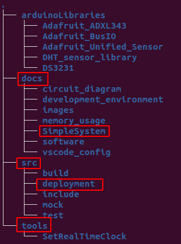

# Arduino_Watering_System

This repo was created for my own plant watering system on my balcony. The project has basically reached the development peak.
With the current ressources of an Arduino Uno further feature development is pretty limited. So in the future activities will
be limited. And if time allows I will spend my energy in better unit tests and refactoring work.

You'll find the website of this repository here: https://meadowstress.github.io/Arduino_Watering_System/

There are several folders in the repo. The most interesting for others is possibly the "src/deployment" folder. You can have a
look at the Arduino entry point in the "deployment.ino". All self written libraries are within the "deployment" folder.

If you want to recreate my plant watering system or parts of it you can have a look at the "doc" folder. In "circuit_diagram"
you find a Fritzing diagramm of my system. In "software" you'll find some useful tipps on how to handle the code.

If you just want to get started with programming an Arduino you'll find in docs/SimpleSystem a simplistic apporach including
system code and circuit diagramm to get started with an basic Arduino watering system.

All other folders are used for developing this project further and are possibly of minor interest to you:
The folder "src" contains the development code of my project including all unit tests. I use this folder to develop Arduino
code on my PC in order to speed up development. In "tools" you find scripts which are necessary in order to configure used
hardware parts.

## Overview

### Control Box

## Pump and Valves

## Tubes to top Plants

## Tubes to bottom Plants

